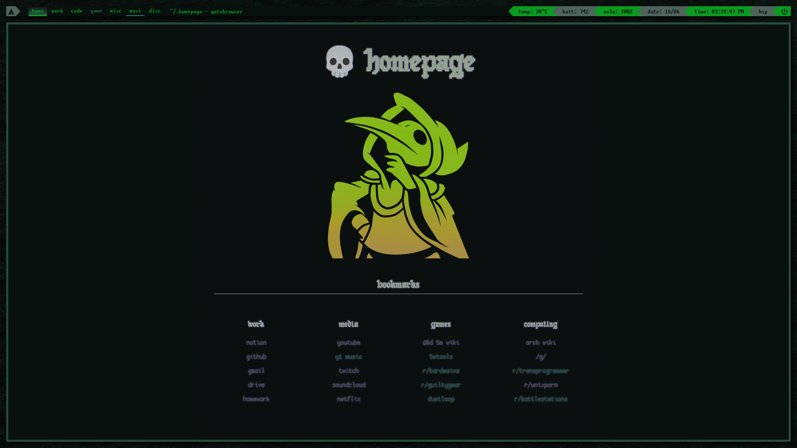

# homepage

Here's my simple homepage. It imports bookmarks from `bookmarks.js`, colours from `~/.cache/wal/colors.css`, and a random image from the `art` folder.

[Live Preview](https://bean499.github.io/homepage/) - Note that colours and art will be broken in this preivew mode, since it can't import any from pywal or the `art` folder.

## credits
- CSS Framework: [ElementCSS](https://elementcss.neocities.org/)
- Fonts: [Cozette](https://github.com/slavfox/Cozette) & [Old English Gothic Pixel](https://fontstruct.com/fontstructions/show/1535174/old-english-gothic-pixel) 
- CRT CSS: [From this article on aleclownes.com](http://aleclownes.com/2017/02/01/crt-display.html) 
- Colorscheme: Imported from [Pywal](https://pypi.org/project/pywal/) cache - **Note you will have to change the username from "bean" to yours for this to work.**
- Art used in example screenshot: Plague Knight from Shovel Knight, found on [this Imgur post](https://imgur.com/jKsPFPh)
